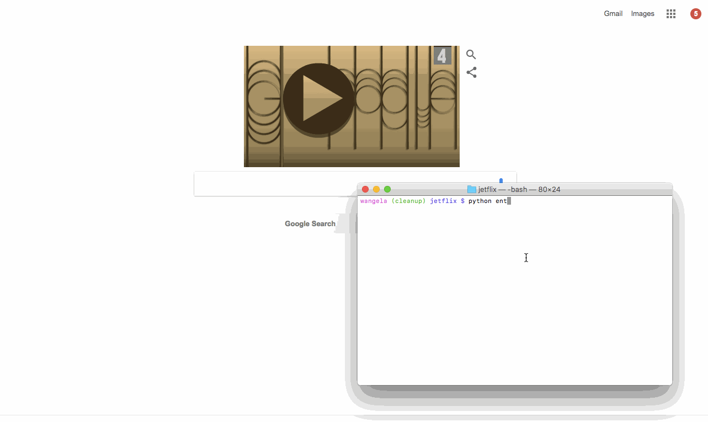

# Jetflix

Jetflix is a website for viewing a catalog of videos.

Submitted by: Angela Yu

Languages: The backend is written in Python, and the front end is written in HTML, CSS, JavaScript, and jQuery generated by the Python code.

## User Stories

The following **required** functionality is complete:

* [x] User can view thumbnails of several movie posters
* [x] User can click on a movie poster to view the trailer video

The following **additional** features are implemented:
* [x] Movies are displayed in order sorted by title
* [X] Trailer video plays in a dedicated space on the screen
* [x] Look & feel of the site mimics modern media browsing patterns
* [x] Additional details about the movie are displayed
* [ ] TV shows can also be browsed in the catalog
* [ ] TV show details are different than movie details (still image instead of trailer, number of seasons instead of duration)
* [ ] User can choose between viewing a list of all videos, only movies, or only TV shows

## Video Walkthrough 

Here are walkthroughs of implemented user stories:

| v1 walkthrough (as instructed by course) | v2 walkthrough (emulating streaming media site experience) |
|:----:|:----:|
|  |  |

GIFs created with [LiceCap](http://www.cockos.com/licecap/).

## How To Use

1. Clone this repo
2. Navigate to the directory on your local machine
3. Run the command `python entertainment_center.py`

## License

    Copyright 2017 Angela Yu

    Licensed under the Apache License, Version 2.0 (the "License");
    you may not use this file except in compliance with the License.
    You may obtain a copy of the License at

        http://www.apache.org/licenses/LICENSE-2.0

    Unless required by applicable law or agreed to in writing, software
    distributed under the License is distributed on an "AS IS" BASIS,
    WITHOUT WARRANTIES OR CONDITIONS OF ANY KIND, either express or implied.
    See the License for the specific language governing permissions and
    limitations under the License.